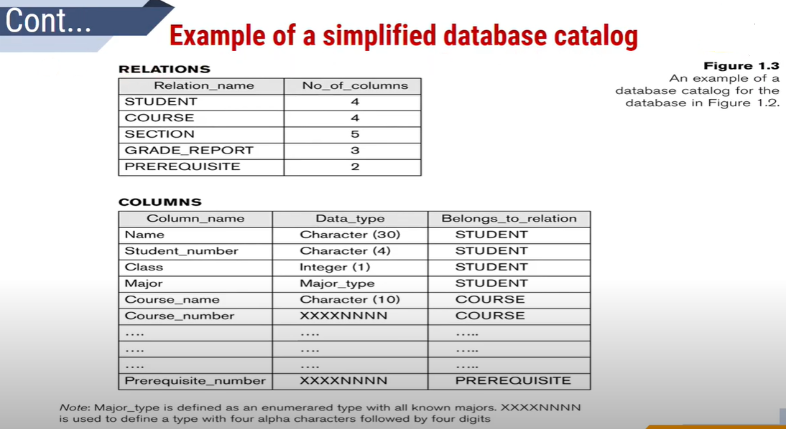

# Module1

## Introduction

- A database is a collection of related data.
- collection of related data with an implicit meaning is a database
- A database is a logically coherent collection of data with some inherent
meaning.
- A database can be of any size and complexity
- A database may be generated and maintained manually or it may be  computerized

DBMS:

- DBMS is a collection of programs that enables the users to create and maintain a database
- A query typically causes some data to be retrieved; a transaction may cause
some data to be read and some data to be written into the database
- Other important functions provided by the DBMS include protecting the  database and maintaining it over a long period of time
- 
- In traditional file processing, the structure of data files is embedded in the application programs, so any changes to the structure of a file may require changing all programs that access that file
- The structure of data files is stored in the DBMS catalog separately from the access programs. 
We call this property program-data independence
- 